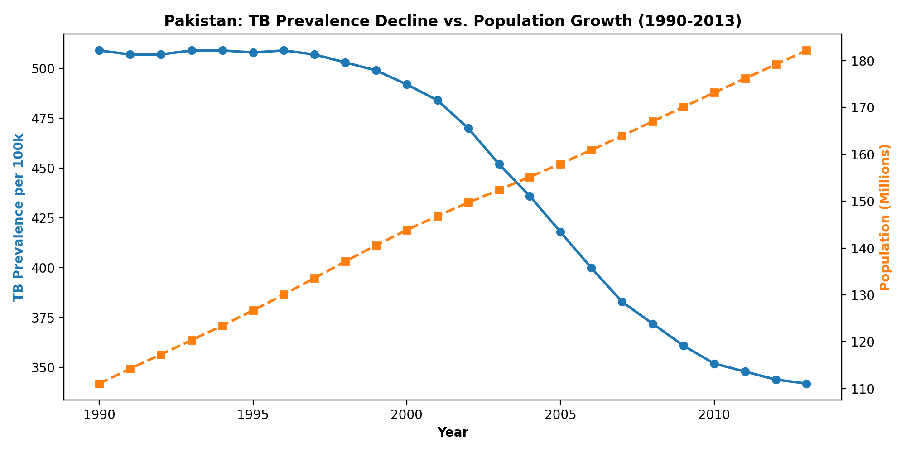
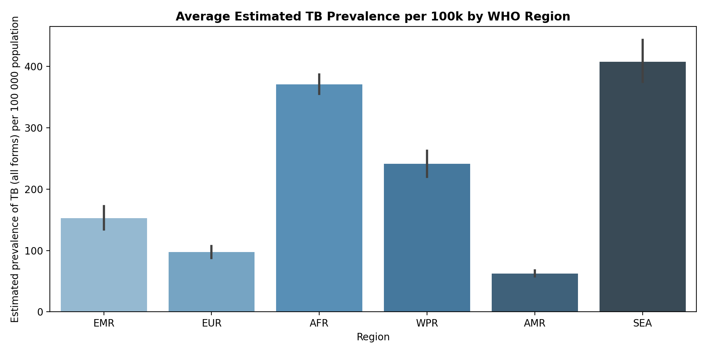
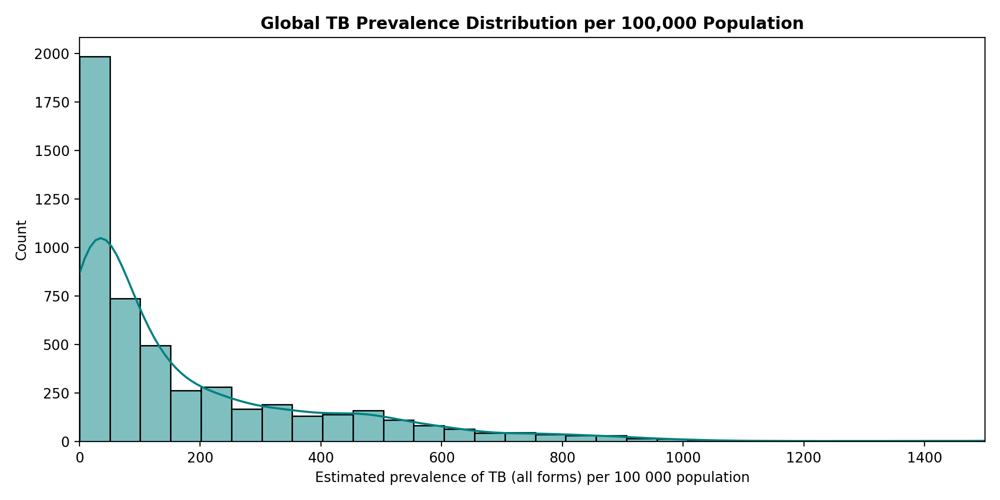
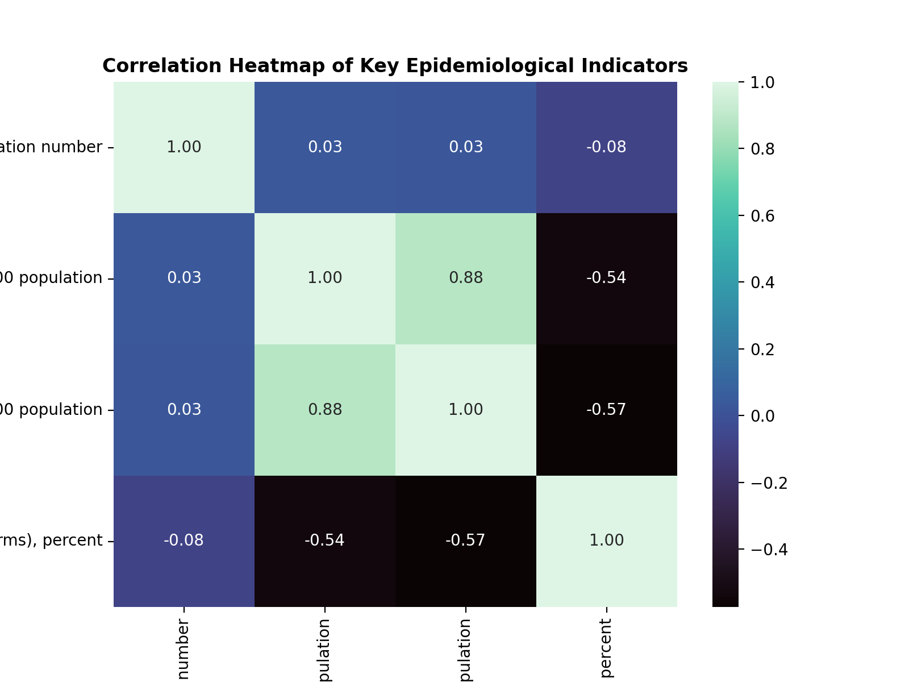

# 🐍 Python for Data Science: From Fundamentals to Exploratory Data Analysis (EDA)


Welcome to the **Python for Data Science** repository! This repository contains a structured, step-by-step learning progression covering core Python programming fundamentals, control flow, functions, and real-world Exploratory Data Analysis (EDA) on global health datasets using **Pandas**, **NumPy**, **Matplotlib**, and **Seaborn**.

---

## 📋 Table of Contents

- [Overview](#-overview)
- [Project Architecture](#-project-architecture)
- [Daily Module Breakdown](#-daily-module-breakdown)
  - [Day 01: Python Fundamentals](#day-01-python-fundamentals)
  - [Day 02: Control Structures & Functions](#day-02-control-structures--functions)
  - [Day 03: Data Analysis & EDA (Global Tuberculosis Burden)](#day-03-data-analysis--eda-global-tuberculosis-burden)
- [Dataset Specifications](#-dataset-specifications)
- [Key EDA Findings & Case Study](#-key-eda-findings--case-study)
- [📈 Exploratory Data Analysis Visualizations](#-exploratory-data-analysis-visualizations)
- [Tech Stack & Dependencies](#-tech-stack--dependencies)
- [Getting Started & Running Locally](#-getting-started--running-locally)
- [How to Push to GitHub](#-how-to-push-to-github)
- [License & Acknowledgments](#-license--acknowledgments)

---

## 🎯 Overview

The primary goal of this repository is to bridge the gap between basic Python syntax and practical data manipulation. The repository is organized into daily learning modules:

1. **Foundational Syntax**: Master variables, user input parsing, type conversion, and conditional evaluation.
2. **Control Logic & Reusability**: Implement loops, custom functions, and library imports.
3. **Data Science & EDA**: Work with large real-world tabular data (`TB_Burden_Country.csv`), perform data cleaning, missing value handling, summary statistics, and trend visualizations.

---

## 📁 Project Architecture

```microservice
Python_for_data_sci/
│
├── 📂 Day_01/                         # Python Basics
│   ├── basic_script_01.py             # Intro syntax & output operations
│   ├── 02_Variables.py                # Variable assignments & data types
│   ├── 03_Input_variables.py          # Parsing & formatting user input
│   ├── 04_conditional_logics.py       # Logical & boolean comparison operations
│   └── 05_type_conversion.py          # Implicit & explicit type casting
│
├── 📂 Day_02/                         # Control Flow & Functions
│   ├── if_else_elif.py                # Nested conditionals & decision tree logic
│   ├── loop.py                        # For & While loops, iterative sequences
│   ├── functions.py                   # Reusable function blocks & parameters
│   └── how_to_import_libraries.py     # Importing built-in & third-party packages
│
├── 📂 Day_03/                         # Data Analysis & Visualizations
│   ├── TB_Burden_Country.csv          # Global Tuberculosis Burden Dataset (WHO)
│   ├── introduction_to_panda.ipynb    # Pandas DataFrames, Series & indexing
│   ├── pandas_02.ipynb                # Filtering, selection & column operations
│   ├── data_importing_and_visualization.ipynb  # Environment setup & library check
│   ├── pandas_03_EDA.ipynb            # In-depth Exploratory Data Analysis & plots
│   └── 📂 figures/                    # Generated High-Resolution Charts
│       ├── pakistan_tb_trend.png
│       ├── regional_tb_comparison.png
│       ├── tb_prevalence_distribution.png
│       └── tb_metrics_correlation.png
│
├── make_plots.py                      # Plot generation script
└── README.md                          # Repository Documentation
```

---

## 📚 Daily Module Breakdown

### Day 01: Python Fundamentals

Focuses on foundational programming concepts in Python:

- **`basic_script_01.py`**: Syntax structure, output display using `print()`, and mathematical expressions.
- **`02_Variables.py`**: Declaring primitive types (`int`, `float`, `str`, `bool`), variable naming rules, and dynamic typing.
- **`03_Input_variables.py`**: Interacting with users via `input()`, converting string inputs into numeric types.
- **`04_conditional_logics.py`**: Comparison operators (`==`, `!=`, `>`, `<`, `>=`, `<=`) and logical operations (`and`, `or`, `not`).
- **`05_type_conversion.py`**: Converting data types safely (e.g., `str()` to `int()`, `float()` casting).

---

### Day 02: Control Structures & Functions

Covers logic execution control and writing clean, modular Python code:

- **`if_else_elif.py`**: Structuring branching logic to execute code based on evaluated conditions.
- **`loop.py`**: Iterating over sequences using `for` loops, managing conditional repeats with `while` loops, and utilizing `range()`.
- **`functions.py`**: Defining functions using `def`, passing arguments, returning calculated outputs, and writing docstrings.
- **`how_to_import_libraries.py`**: Managing module imports (`import math`, `import pandas as pd`, `import numpy as np`).

---

### Day 03: Data Analysis & EDA (Global Tuberculosis Burden)

Applies data science techniques to analyze WHO Tuberculosis (TB) data:

- **`TB_Burden_Country.csv`**: Comprehensive epidemiological dataset spanning multiple countries from 1990 to 2013.
- **`introduction_to_panda.ipynb`**: Reading CSV files with `pd.read_csv()`, inspecting data structures (`.head()`, `.tail()`, `.shape`, `.info()`, `.describe()`).
- **`pandas_02.ipynb`**: Subset selection, conditional row filtering, column additions, and dropping redundant data.
- **`data_importing_and_visualization.ipynb`**: Setting up data analysis environments, package installation management, and previewing interactive plots.
- **`pandas_03_EDA.ipynb`**: Comprehensive Exploratory Data Analysis:
  - **Data Hygiene**: Detecting missing records (`.isnull().sum()`), dropping 100% empty columns (`.dropna(axis=1, how="all")`), and deduplication (`.drop_duplicates()`).
  - **Univariate Analysis**: Statistical summaries of estimated TB prevalence, mortality rates, and case detection rates.
  - **Bivariate & Time-Series Analysis**: Tracking population growth vs. TB prevalence rate per 100,000 population.
  - **Data Visualization**: Generating distribution plots, trend line plots, and regional comparative bar charts with Seaborn and Matplotlib.

---

## 📊 Dataset Specifications

The dataset used in **Day 03** (`TB_Burden_Country.csv`) is sourced from World Health Organization (WHO) epidemiological reports.

| Attribute | Details |
| :--- | :--- |
| **Total Records** | 5,120 rows |
| **Total Columns** | 47 attributes |
| **Time Period** | 1990 – 2013 |
| **Key Features** | Country/Territory Name, ISO Codes, Region, Year, Estimated Total Population, TB Prevalence (per 100k), TB Mortality (excluding HIV & HIV-positive), Case Detection Rate (CDR) |

---

## 💡 Key EDA Findings & Case Study

### Pakistan TB Burden Trend Analysis (1990 - 2013)

By extracting and analyzing data specifically for **Pakistan** in `pandas_03_EDA.ipynb`, several key epidemiological trends emerged:

1. **Population Growth**: Pakistan's estimated population grew from **~111.09 Million** in 1990 to **~182.14 Million** in 2013.
2. **Prevalence Rate Reduction**:
   - In 1990, the estimated TB prevalence was **509 cases per 100,000 population**.
   - By 2013, the prevalence dropped significantly to **342 cases per 100,000 population**.
   - This represents a steady decline over two decades due to enhanced global detection and treatment efforts.
3. **Data Quality Management**:
   - Identical zero-entry columns (such as `Method to derive TBHIV estimates`) were safely dropped.
   - Missing boundary metrics were filtered to ensure unbiased statistical outputs.

---

## 📈 Exploratory Data Analysis Visualizations

Below are key visual insights generated from `pandas_03_EDA.ipynb`:

### 1. Pakistan TB Prevalence Decline vs. Population Growth (1990 – 2013)
Dual-axis time-series visualization showing population growth alongside a continuous decline in TB prevalence per 100,000 population.



### 2. Regional TB Prevalence Comparison across WHO Regions
Bar chart showing average estimated TB prevalence rate per 100k population grouped by WHO region.



### 3. Global TB Prevalence Distribution
Histogram with KDE curve illustrating the right-skewed distribution of global TB prevalence rates across all recorded country-years.



### 4. Correlation Matrix of Epidemiological Indicators
Heatmap highlighting linear relationships between total population, TB prevalence rates, mortality rates, and case detection rates.



---

## 🛠️ Tech Stack & Dependencies

- **Programming Language**: Python 3.10+
- **Data Manipulation**: `pandas`, `numpy`
- **Data Visualization**: `matplotlib`, `seaborn`, `plotly`
- **Machine Learning / Analytics**: `scikit-learn`, `scipy`
- **Interactive Framework**: `jupyter`, `streamlit`

---

## 🚀 Getting Started & Running Locally

### 1. Clone the Repository

```bash
git clone https://github.com/Abdul3442/Python_for_data_sci.git
cd Python_for_data_sci
```

### 2. Create & Activate a Virtual Environment (Optional)

```bash
# Windows
python -m venv venv
venv\Scripts\activate

# macOS / Linux
python3 -m venv venv
source venv/bin/activate
```

### 3. Install Dependencies

```bash
pip install pandas numpy matplotlib seaborn plotly scikit-learn jupyter streamlit
```

### 4. Run Scripts & Notebooks

- **Run Python Scripts**:
  ```bash
  python Day_01/basic_script_01.py
  python Day_02/functions.py
  ```

- **Generate Figures & Charts**:
  ```bash
  python make_plots.py
  ```

- **Launch Jupyter Notebooks**:
  ```bash
  jupyter notebook
  ```
  Open `Day_03/pandas_03_EDA.ipynb` in your browser and run all cells.

---

## 📤 How to Push Updates to GitHub

```bash
git add .
git commit -m "Add EDA visualizations, figure plots, and updated README"
git push -u origin main
```

---

## 🤝 License & Acknowledgments

- **Dataset Credit**: World Health Organization (WHO) Global Tuberculosis Report.
- **License**: MIT License - feel free to use, modify, and learn from this repository!

---
*Created with ❤️ for Data Science Enthusiasts.*
